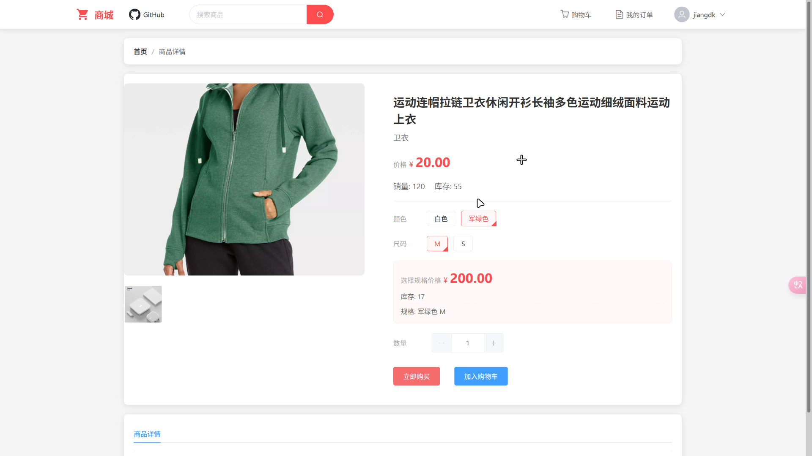

## POWER-MALL是一个以微服务为架构的商城系统。
### 包含以下模块：
- 用户模块
- 商品模块
- 订单模块
- 支付模块
- oss模块
- 搜索模块
### 实现的功能：
- 用户账密注册登录、手机号登录、邮箱登录注册
- 用户从商品列表中选择商品加入购物车或者直接下单付款，提交订单，支付等一系列流程。
- MinIO对象存储商城所有图片、Elasitcsearch快速搜索商品
- RabbitMQ实现订单消息队列、以及es和数据库的数据同步等等。
### 成果图
___
**商城主页**

___
**登录和注册页面**

___
**购买商品页面**

___
**确认订单页面**

___
**我的订单**

## 相关连接
### [管理端前端](https://github.com/jiangdengke/power-mall-fronted-admin)
### [应用端前端](https://github.com/jiangdengke/power-mall-fronted-user)
